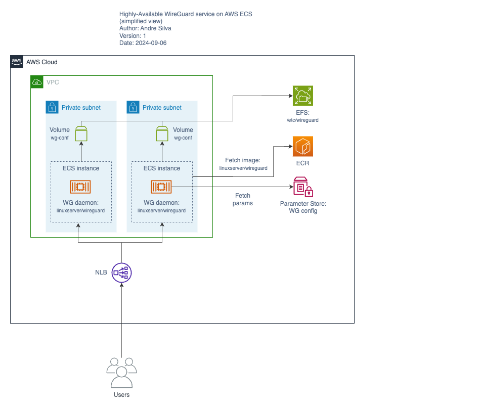

# Highly-Available WireGuard service on AWS ECS



## Download peer configuration

Connect to the WireGuard container:

```sh
aws ecs execute-command --cluster "${CLUSTER_NAME}" \
    --task "${TASK_ID}" \
    --container wireguard \
    --interactive \
    --command "/bin/bash"
```

Copy the contents of the peer `.conf` file:

```txt
cat /config/peer_<name>/peer_<name>.conf
```

## References

<https://www.procustodibus.com/blog/2022/05/wireguard-on-ecs/>

<https://www.procustodibus.com/blog/2021/02/ha-wireguard-on-aws/>

<https://www.jdieter.net/posts/2020/05/31/multi-region-vpn-aws/>

<https://www.perdian.de/blog/2021/12/27/setting-up-a-wireguard-vpn-at-aws-using-terraform/>

### AWS

<https://repost.aws/questions/QUaG4liNoLQsymZdj3qUy8rg/troubleshoot-nlb-udp-flows>

<https://docs.aws.amazon.com/elasticloadbalancing/latest/network/load-balancer-security-groups.html>

<https://docs.aws.amazon.com/elasticloadbalancing/latest/network/target-group-health-checks.html>

### NLB healthcheck for UDP ECS service

<https://stackoverflow.com/questions/57698978/healthcheck-for-networkloadbalancer-with-udp-ecs-service>

<https://github.com/aws/containers-roadmap/issues/850>

<https://www.procustodibus.com/blog/2021/03/wireguard-health-check-for-python-3/>

<https://docs.docker.com/engine/network/links/>

### linuxservers/wireguard

<https://docs.linuxserver.io/images/docker-wireguard/>

### S6

The linuxservers.io images use S6 process supervision, through a project maintained by the creator of S6 and others, the s6-overlay project (s6 overlay for containers).

> One of the oft-repeated Docker mantras is "one process per container", but we disagree. There's nothing inherently bad about running multiple processes in a container. The more abstract "one thing per container" is our policy - a container should do one thing, such as "run a chat service" or "run gitlab." This may involve multiple processes, which is fine. ([justcointaers/s6-overlay/README.md](https://github.com/just-containers/s6-overlay?tab=readme-ov-file#the-docker-way))

<https://skarnet.org/software/s6/index.html>

<https://github.com/just-containers/s6-overlay>

<https://tutumcloud.wordpress.com/2014/12/02/docker-and-s6-my-new-favorite-process-supervisor/>

<https://tutumcloud.wordpress.com/2015/05/20/s6-made-easy-with-the-s6-overlay/>

<https://www.tonysm.com/multiprocess-containers-with-s6-overlay/>

<https://darkghosthunter.medium.com/how-to-understand-s6-overlay-v3-95c81c04f075>

## Acknowledgements

<https://github.com/rupertbg/aws-wireguard-linux>
